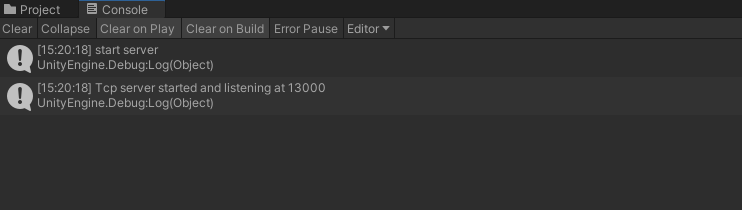
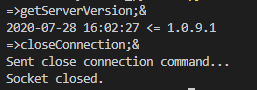
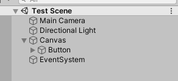

# Hello U3Driver

# UAuto
## 安装方法
### Unity 插件接入
1. 将 `UAutoSDK.dll` 和 `UAutoSdkInit.cs` 添加到 `/Assets/Plugins` 目录下
2. 在场景中新建物体并将 `UAutoSdkInit.cs` 添加到物体中、或者直接将脚本添加到已有游戏物体上。
3. 运行游戏后如果出现如下 log 说明配置成功



### python 环境配置
[项目地址](http://gitlab.testplus.cn/leijiafeng/UAuto_python)

clone 使用命令行进入到 `UAuto_python` 目录，运行下面的指令安装所需模块

>pip install -r requirements.txt

等待安装完成后开始运行：
1. 在本机 Unity 中运行游戏，开启网络监听
2. 运行 `temp_test.py` 脚本，命令如下：

> python temp_test.py -i 127.0.0.1

如果 python 脚本输出如下表示 python 环境配置完成



## Python API
为了解释后面的功能，这里对游戏物体的`路径`进行说明，假如有下面游戏场景



`Button` 的路径为 `/Canvas/Button`

### 通用功能
##### AltrunUnityDriver
初始化 UDriver

```python
from u3driver import AltrunUnityDriver

udriver = AltrunUnityDriver(device_s, "", ip, TCP_PORT=13000, ,timeout=60)
```

参数列表：
- device_s：安卓设备号
- platform：平台，直接传空字符串
- ip：启动游戏机器的 ip 地址
- TCP_PORT：端口号
- timeout：超时重试时间

##### stop
与 Unity 部分断开连接

```python
udriver.stop()
```

##### debug_mode
使用 debugMode 可以直接录制和翻译简单的 UI 事件
目前已支持下面几种录制：
- 点击
- 拖动
- 文本输入

开始录制后，在游戏中执行 UI 操作会试试转化成 python 指令。当操作完成后按住屏幕 5 秒结束录制。

```python
udriver.debug_mode("output_script.py")
```

##### get_screen
获取游戏内屏幕宽高（不一定等于屏幕宽高）

```python
width, height = udriver.get_screen()
```

参数列表：
- file_path：输出的脚本名

##### get_png_screenshot
对游戏进行截图

```python
udriver.get_png_screenshot("pic.jpg")
```

参数列表：
- path：保存图片名

#### 获取游戏物体
##### find_object
寻找场景内路径为 value 的游戏对象并返回 Handler，且只会找到活动（active）的游戏对象。如果没有找到对应游戏对象，将会抛出异常。

```python
udriver.find_object(By.PATH, "//Canvas//Button")
```

参数列表：
- by：通过什么方式进行寻找，如 By.PATH 表示按照路径进行寻找
- value：需要寻找的游戏对象的路径

如果游戏物体路径存在 `/` 符号，例如按钮的名称为 `Button/1`，可以使用 `By.LEVEL` 进行获取：

```python
udriver.find_object(By.LEVEL, "//Canvas//Button/1"
```

##### find
在 `find_object` 返回的已找到的游戏对象 Handler 为基础，进行级联查找，且只会找到活动（active）的游戏对象，同样返回找到的游戏对象 Handler。

```python
obj = udriver.find_object(By.PATH, "//Canvas//A")
obj.find("B//C")

# 相当于
udriver.find_object(By.PATH, "Canvas//A//B//C")
```

参数列表：
- value：需要查找的子级对象目录，无需 `//` 开头。

##### child_index
在 `find_object` 返回的已找到的游戏对象 Handler 为基础，获取给定下标的子对象，且只会找到活动（active）的游戏对象，同样返回找到的游戏对象 Handler。

```python
# 当子对象名字重复，使用该函数查找
obj = udriver.find_object(By.PATH, "//Canvas//Parent")
obj.child_index(0)
```

参数列表：
- value：子级对象的下标，从 0 开始。

##### parent
在 `find_object` 返回的已找到的游戏对象 Handler 为基础，获取父对象，且只会找到活动（active）的游戏对象，同样返回找到的游戏对象 Handler。

```python
obj = udriver.find_object(By.PATH, "//Canvas//A//B")
obj.parent()

# 相当于
udriver.find_object(By.PATH, "//Canvas//A")
```

##### find_object_which_contains
寻找所有名字包含 value 且活动（active）的游戏对象，返回的列表中包含所有找到的游戏对象。

```python
ret = udriver.find_object_which_contains("gameObjectName")
```

参数列表：
- value：需要寻找的游戏对象的名字或名字一部分

##### find_object_in_range_where_name_contains
在指定的路径下寻找名字包含 `value` 且活动（active）的直接子游戏对象，返回的列表中包含所有找到的游戏对象。

```python
ret = udriver.find_object_in_range_where_name_contains("name", "//Canvas//parentName")
```

参数列表：
- value：需要寻找的游戏对象的名字或名字一部分
- range_path：需要寻找的游戏对象的直接父级的路径

##### object_exise
判断物体是否存在且活动（active）。

```python
exist = udriver.object_exise(By.PATH, "//Canvas//name")
```

参数列表：
- by：通过什么方式寻找游戏对象，目前只支持 `by.PATH` 通过路径进行寻找
- value：需要判断的物体的路径

##### find_object_in_range_where_text_contains
在父游戏物体的直接子级物体下的指定路径寻找文本内容包含 `value` 且活动（active）的游戏物体，返回的列表中包含所有找到的游戏物体。

```python
ret = udriver.find_object_in_range_where_text_contains("childPath", "value", "parentPath")

# 可以找到如下的游戏物体：
# /parentPath/1/childPath
# /parentPath/2/childPath
# /parentPath/3/childPath
```

参数列表：
- childPath：子游戏对象的路径（与父游戏对象不是直接父子级关系，中间隔了一层）
- value：需要包含的文本字符串
- parentPath：父游戏对象的路径

##### find_child
获取一个父游戏物体的所有直接子游戏物体的名字。

```python
childs = udriver.find_child("//Canvas//parentName")
```

参数列表：
- value：父游戏物体的层级目录

##### get_object_rect
获取一个 UI 矩形的中心点和四个顶点的屏幕坐标。

```python
ret = udriver.get_object_rect("//Canvas//name")
print(ret['Center'])
print(ret['BottomLeft'])
print(ret['TopLeft'])
print(ret['TopRight'])
print(ret['BottomRight'])
```

参数列表：
- value：游戏物体的路径

##### find_all_objects
获取一个物体下的所有子孙级物体，返回的列表中包含所有找到的游戏对象。

```python
objects = udriver.find_all_objects("//Canvas")
```

参数列表：
- value：游戏物体的路径

##### find_all_objects_where_text_contains
获取所有 text 包含对应文本的游戏物体，该游戏物体必须拥有 `Text` 或 `InputField` 组件，返回的列表中包含所有找到的游戏对象。

```python
objects = udriver.find_all_objects_where_text_contains("text")
```

#### UI 操作
##### tap
对游戏对象发起点击事件

```python
button = udriver.find_object(By.PATH, "//Canvas//Button")
button.tap()
```

##### get_text
获取游戏对象的 `text` 属性，该游戏对象必须拥有 `Text` 或 `InputField` 组件。

```python
text = udriver.find_object(By.PATH, "//Canvas//Text")
str = text.get_text()
```

##### set_text
给游戏对象的 `text` 属性设置值，该游戏对象必须拥有 `InputField` 组件。

```python
text = udriver.find_object(By.PATH, "//Canvas//Text")
str = text.set_text('this is text')
```

参数列表：
- value：设置文本的字符串

##### find_object_and_tap
寻找游戏物体，如果找到且是活动（active）的，对游戏对象发起一次点击事件。

```python
udriver.find_object_and_tap(By.PATH, "//Canvas//Button")
```

参数列表：
- by：通过什么方式寻找游戏对象，目前只支持通过路径进行寻找
- value：需要寻找的游戏对象

##### tap_at_coordinates
对屏幕上指定一点的 UI 触发点击事件。

```python
# 屏幕坐标(480, 720)
udriver.tap_at_coordiates("480", "720")
```

##### get_value_on_component
获取一个游戏物体中指定的组件上的指定值。

```python
ret = udriver.get_value_on_component("//Canvas//Image", "Image", "color")
```

参数列表：
- path：游戏物体的路径
- component_name：组件名
- value_name：属性名

##### drag_object
对 UI 控件触发拖动事件

```python
# 从 UI 控件中心点开始拖动到 (400, 200)
udriver.drag_object("//Canvas//Slider", 400, 200)

# 从 (400, 100) 拖动 UI 到 (400, 200)
udriver.drag_object("//Canvas//Slider", 400, 100, 400, 200)
```

### 项目接口
##### ubox
开启、关闭 ubox 数据采集

```python
udriver.ubox('2')
```

##### move_to
移动到指定坐标点

```python
udriver.move_to(x, y, z)
```

参数列表：
- x：x 坐标
- y：y 坐标
- z：z 坐标

##### is_auto_path
判断当前是否正在自动寻路

```python
ret = udriver.is_auto_path()
```

##### get_plr_pos
获取角色当前场景 ID 以及坐标点

```python
udriver.get_plr_pos()
```

##### goto_scene
去到指定场景

```python
udriver.goto_scene("1001")
```

参数列表：
- id:模板ID，详情可以参考 `scenelist.txt`

##### auto_fight
开启自动战斗

```python
udriver.auto_fight()
```

##### goto_fuben
去到指定副本

```python
udriver.goto_fuben("1022")
```

参数列表：
- id:模板ID，详情可以参考 `scenelist.txt`

##### add_exp
为角色增加经验值

```python
udriver.add_exp(100000000)
```

参数列表：
- exp:需要增加的经验值

## 已完成的案例
跑图，场景切换，门派选择，捏脸系统，UI遍历，小队野外挂机

### 运行参数

-s：测试使用的安卓设备号

-i: 测试使用的安卓ip地址

-b：性能采集类型，0：使用 Ubox 采集，1：使用 TestPlus 采集，其他数字：不采集

-t：是否跳过安装新包：0：安装新包，1：跳过安装（建议提前在机器上安装好新包，自动装包需要机器配置好相关环境，这一步比较麻烦）

-a：新包的下载地址

-user：使用的账号

-server：使用的服务器

-package：使用的包名

### 跑图

游戏准备：准备一个已经过好新手教程的账号

运行方法：

> python map_test.py -s "安卓设备号" -t 1 -a "http://10.11.88.13:8088/jxsj.apk" -b 2 -user "cs" -server 50 -package "com.sea.jxsj3.xsj"
  或
>python map_test.py -s "安卓设备号" -t 1 -i "ip地址" -a "http://10.11.88.13:8088/jxsj.apk" -b 2 -user "cs" -server 50 -package "com.sea.jxsj3.xsj"

### 场景切换

游戏准备：准备一个已经过好新手教程的账号

运行方法：

> python switch_scene_test.py -s "安卓设备号" -t 1 -a "http://10.11.88.13:8088/jxsj.apk" -b 2 -user "cs" -server 50 -package "com.sea.jxsj3.xsj"
  或
>python switch_scene_test.py -s "安卓设备号" -t 1 -i "ip地址" -a "http://10.11.88.13:8088/jxsj.apk" -b 2 -user "cs" -server 50 -package "com.sea.jxsj3.xsj"

### 门派选择

运行方法：
>python create_role_test.py -s "安卓设备号" -t 1 -a "http://10.11.88.13:8088/jxsj.apk" -b 2 -package "com.sea.jxsj3.xsj"
  或
>python create_role_test.py -s "安卓设备号" -t 1 -i "ip地址" -a "http://10.11.88.13:8088/jxsj.apk" -b 2 -user "cs" -server 50 -package "com.sea.jxsj3.xsj"

### 捏脸系统
运行方法：
>python role_face_test.py -s "安卓设备号" -t 1 -a "http://10.11.88.13:8088/jxsj.apk" -b 2 -package "com.sea.jxsj3.xsj"
  或
>python role_face_test.py -s "安卓设备号" -t 1 -i "ip地址" -a "http://10.11.88.13:8088/jxsj.apk" -b 2 -user "cs" -server 50 -package "com.sea.jxsj3.xsj"

### UI遍历

游戏准备：准备一个已经升满级的账号

运行方法：

> python ui_traverse_test.py -s "安卓设备号" -t 1 -a "http://10.11.88.13:8088/jxsj.apk" -b 2 -user "cs" -server 50 -package "com.sea.jxsj3.xsj"
  或
>python ui_traverse_test.py -s "安卓设备号" -t 1 -i "ip地址" -a "http://10.11.88.13:8088/jxsj.apk" -b 2 -user "cs" -server 50 -package "com.sea.jxsj3.xsj"


### 小队野外挂机

游戏准备：准备4个已经升满级的账号，起始位置在20级异化蝎子

运行方法：

> python fight_test.py -s "安卓设备号" -t 1 -a "http://10.11.88.13:8088/jxsj.apk" -b 2 -user "cs" -server 50 -package "com.sea.jxsj3.xsj"
  或
>python fight_test.py -s "安卓设备号" -t 1 -i "ip地址" -a "http://10.11.88.13:8088/jxsj.apk" -b 2 -user "cs" -server 50 -package "com.sea.jxsj3.xsj"